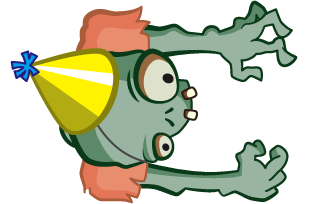
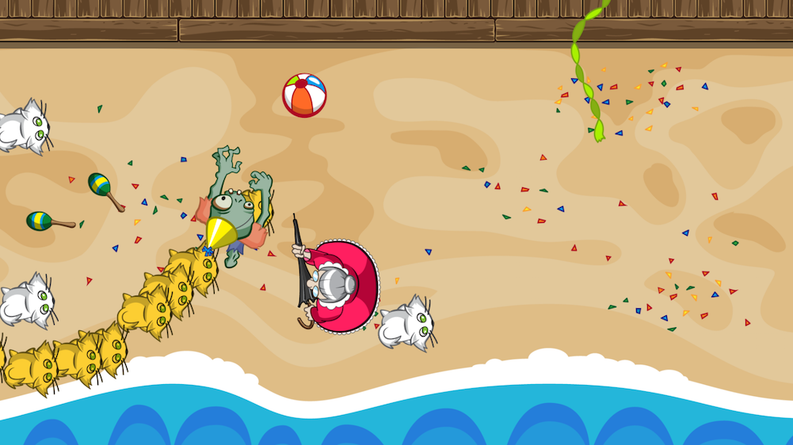
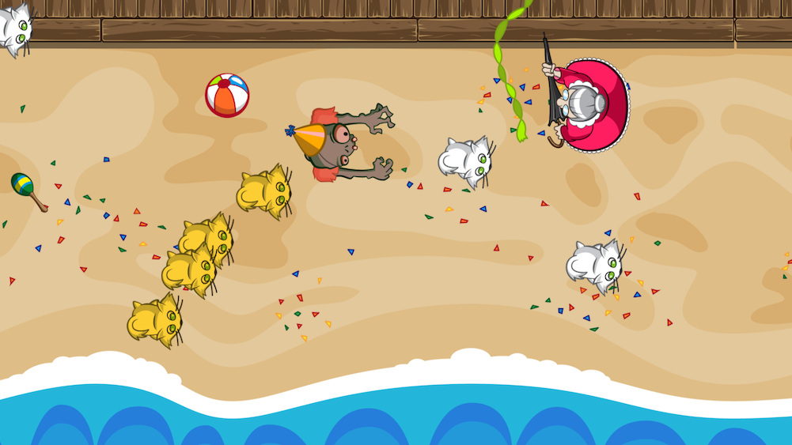

# Zombie Conga

Play the role of a zombie who's sole mission is to break the world record for the longest conga line of cats!

### Dependencies

While an [Apple Developer](https://developer.apple.com/) account is not required to run the project, it is highly recommended.

+ XCode 9.0
+ iOS 11.0

### Gameplay

Who ever said you herding cats was hard? In Zombie Conga, you play the role of a zombie who's sole mission is to break the world record for the longest conga line of cats! There's only one problem...



You're not alone! Avoid the crazy cat lady or she will steal two of the cats in your conga line. If she steals your cats five times, you lose!



### Future Plans

No future work is planned at this time.

### Attribution

This project was produced step-by-step using [Ray Wenderlich's 2D Apple Games by Tutorials](https://amzn.to/2K7ECUt). Development is authorized according to the following license:

```
Copyright (c) 2017 Razeware LLC

Permission is hereby granted, free of charge, to any person obtaining a copy
of this software and associated documentation files (the "Software"), to deal
in the Software without restriction, including without limitation the rights
to use, copy, modify, merge, publish, distribute, sublicense, and/or sell
copies of the Software, and to permit persons to whom the Software is
furnished to do so, subject to the following conditions:

The above copyright notice and this permission notice shall be included in
all copies or substantial portions of the Software.
 
Notwithstanding the foregoing, you may not use, copy, modify, merge, publish,
distribute, sublicense, create a derivative work, and/or sell copies of the
Software in any work that is designed, intended, or marketed for pedagogical or
instructional purposes related to programming, coding, application development,
or information technology.  Permission for such use, copying, modification,
merger, publication, distribution, sublicensing, creation of derivative works,
or sale is expressly withheld.

THE SOFTWARE IS PROVIDED "AS IS", WITHOUT WARRANTY OF ANY KIND, EXPRESS OR
IMPLIED, INCLUDING BUT NOT LIMITED TO THE WARRANTIES OF MERCHANTABILITY,
FITNESS FOR A PARTICULAR PURPOSE AND NONINFRINGEMENT. IN NO EVENT SHALL THE
AUTHORS OR COPYRIGHT HOLDERS BE LIABLE FOR ANY CLAIM, DAMAGES OR OTHER
LIABILITY, WHETHER IN AN ACTION OF CONTRACT, TORT OR OTHERWISE, ARISING FROM,
OUT OF OR IN CONNECTION WITH THE SOFTWARE OR THE USE OR OTHER DEALINGS IN
THE SOFTWARE.
 ```
>>>>>>> ZombieConga/master
