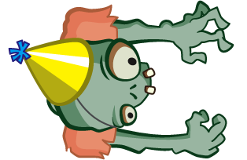

# Zombie Conga
This game's initial content was built step-by-step from Ray Wenderlich's Tutorial Book [2D Apple Games by Tutorials](https://store.raywenderlich.com/products/2d-apple-games-by-tutorials)

### Dependencies

While an [Apple Developer](https://developer.apple.com/) account is not required to run the project, it is highly recommended.

+ XCode 9.0
+ iOS 11.0

### Gameplay

Who ever said you herding cats was hard? In Zombie Conga, you play the role of a zombie who's sole mission is to break the world record for the longest conga line of cats! There's only one problem...

You're not alone! Avoid the crazy cat lady or she will steal two of the cats in your conga line. If she steals your cats five times, you lose!

### Future Plans
No future work is planned at this time.
